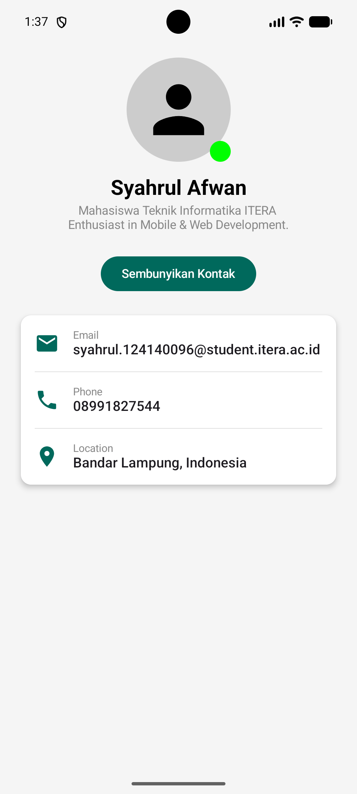
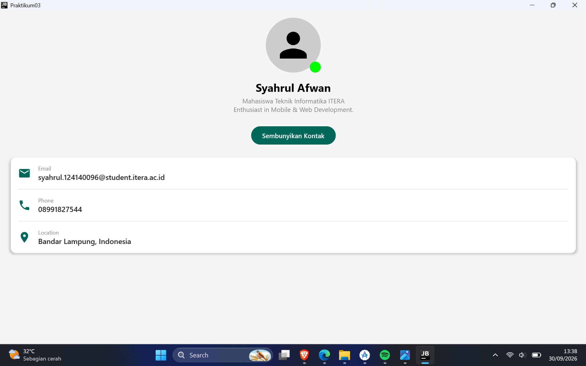

# My Profile App - Praktikum 3

Aplikasi antarmuka pengguna (UI) profil interaktif yang dibangunkan menggunakan paradigma UI Deklaratif dengan Kotlin Multiplatform dan Jetpack Compose.

## Fitur Utama

1. **Paradigma UI Deklaratif**: Menggunakan anotasi `@Composable` untuk membina komponen antarmuka yang reaktif terhadap perubahan.
2. **Basic Layouts**: Menerapkan kombinasi susunan `Column` (menegak), `Row` (mendatar), dan `Box` (bertumpuk/z-index) untuk menyusun elemen UI dengan tepat.
3. **Reusable Composables**: Memisahkan antarmuka kepada komponen modular yang boleh digunakan semula seperti `ProfileHeader`, `ProfileCard`, dan `InfoItem`.
4. **Modifiers**: Menggunakan rantaian (*chaining*) pengubah suai untuk menetapkan saiz, kelegaan (*padding*), warna latar belakang, dan bentuk komponen (contohnya gambar profil berbentuk bulatan).
5. **Animasi (Bonus +10%)**: Penggunaan fungsi `AnimatedVisibility` untuk memaparkan dan menyembunyikan kad maklumat hubungan secara *fade in* dan *fade out*.

## Hasil Paparan (Screenshots)

## Hasil Paparan (Screenshots)

|  Android |  Desktop |
| :---: | :---: |
|  |  |

*(Nota: Gantikan nilai `src` dalam jadual di atas dengan nama fail gambar yang telah anda muat naik ke dalam repositori GitHub ini)*

## Cara Menjalankan

1. *Clone* repositori ini ke komputer tempatan (lokal) anda.
2. Buka projek menggunakan **Android Studio** atau **IntelliJ IDEA**.
3. Tunggu sehingga proses *Gradle Sync* selesai sepenuhnya (memuat turun kebergantungan yang diperlukan).
4. **Untuk menjalankan di Android (Emulator/Peranti Fizikal):**
  * Pilih konfigurasi larian `composeApp` atau `androidApp` pada menu juntai bawah (bersebelahan butang "Run" di panel atas IDE).
  * Klik butang **Run** (ikon segi tiga hijau ▶️).
5. **Untuk menjalankan di Desktop (Komputer):**
  * Buka tab **Terminal** di bahagian bawah perisian IDE anda, kemudian jalankan perintah berikut:

    ```bash
    ./gradlew :composeApp:run
    ```
    *(Atau sesuaikan dengan nama modul utama projek anda sekiranya ia berbeza).*