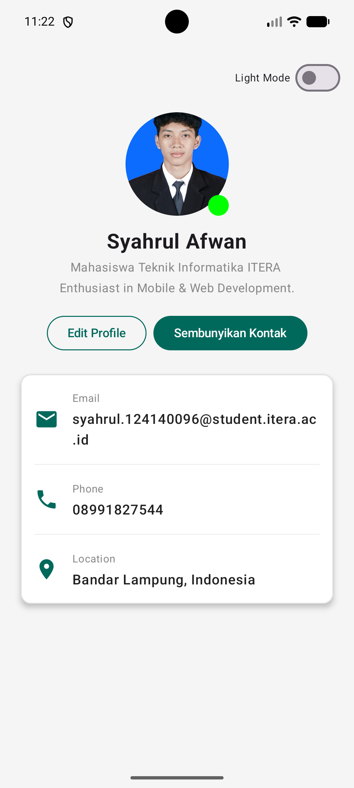
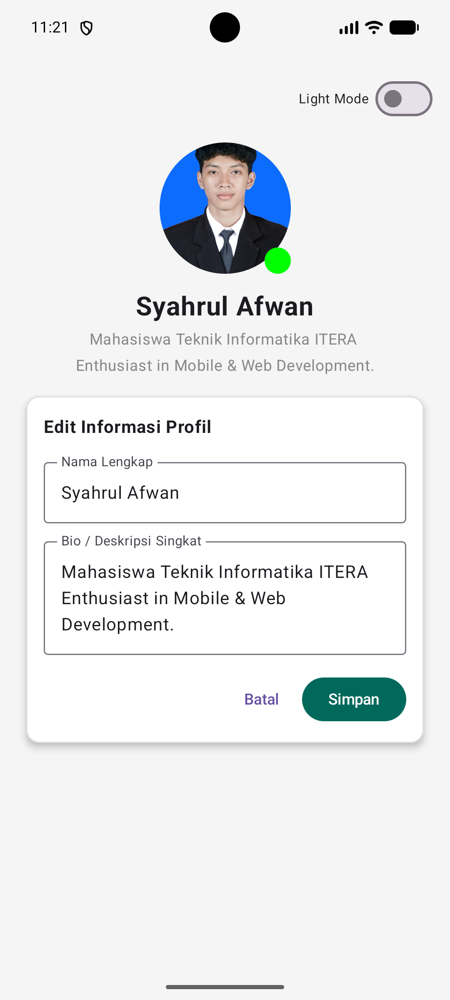
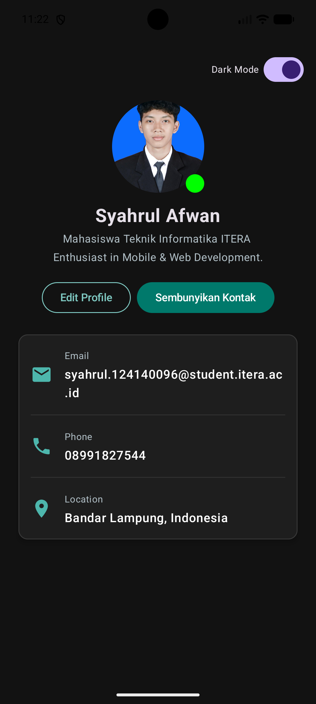

# My Profile App - Praktikum 4

Aplikasi antarmuka pengguna (UI) profil interaktif yang dikembangkan menggunakan arsitektur **MVVM (Model-View-ViewModel)** dan **State Management** pada Compose Multiplatform (Kotlin Multiplatform & Jetpack Compose).

---

## Fitur Utama

1. **Arsitektur MVVM (Model-View-ViewModel)**: Memisahkan tampilan UI (`ProfileScreen`), logika bisnis (`ProfileViewModel`), dan data state (`ProfileUiState`) untuk menghasilkan kode yang bersih, terstruktur, dan mudah diuji (_testable_).
2. **UI State Pattern & Reactive State Flow**: Menggunakan `data class ProfileUiState` dan `StateFlow` (`MutableStateFlow`) di ViewModel untuk mengelola seluruh data UI secara reaktif serta tahan terhadap _configuration changes_.
3. **State Hoisting**: Menerapkan pola _State Hoisting_ pada komponen reusabel `LabeledTextField` di mana state mengalir ke bawah via parameter `value` dan event mengalir ke atas via callback `onValueChange`.
4. **Fitur Edit Profile**: Menyediakan form interaktif untuk mengubah nama dan bio secara langsung, lengkap dengan tombol simpan dan batal yang terintegrasi penuh dengan ViewModel.
5. **Fitur Dark Mode Toggle**: Dukungan peralihan tema terang (_Light Mode_) dan tema gelap (_Dark Mode_) secara reaktif menggunakan sakelar `Switch` dan `MaterialTheme`.

---

## Hasil Tampilan (Screenshots)

|                 Profile View                 |                Edit Form                |                Dark Mode                |
| :------------------------------------------: | :-------------------------------------: | :-------------------------------------: |
|  |  |  |
|           _Tampilan Utama Profil_            |         _Form Edit Nama & Bio_          |          _Tampilan Tema Gelap_          |

---

## Cara Menjalankan

1. _Clone_ repositori ini ke komputer lokal Anda.
2. Buka proyek menggunakan **Android Studio** atau **IntelliJ IDEA**.
3. Tunggu hingga proses _Gradle Sync_ selesai sepenuhnya (mengunduh _dependencies_ yang diperlukan).
4. Untuk menjalankan di Android (Emulator/Perangkat Fisik):

- Pilih konfigurasi _run_ `composeApp` atau `androidApp` pada menu _dropdown_ (di sebelah tombol "Run" di panel atas IDE).
- Klik tombol **Run** (ikon segitiga hijau ▶️).

5. Untuk menjalankan di Desktop (Komputer):

- Buka tab **Terminal** di bagian bawah IDE Anda, lalu jalankan perintah berikut:

  ```bash
  ./gradlew :composeApp:run
  ```

  _(Atau sesuaikan dengan nama modul utama proyek Anda jika berbeda)._
